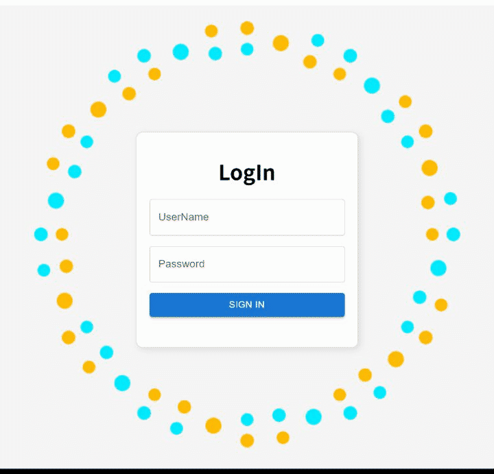

# BookKeeping

React/Vite + Rails GraphQL + MySQL



## Database


## Start

Make sure Docker Desktop has installed.

```
docker compose up --build

# running in back
docker compose up -d  
```

- frontend：http://localhost:4173
- Rails GraphiQL：http://localhost:3000/graphiql
- Rails：http://localhost:3000
- MySQL：`localhost:3306`

## Command

```powershell
# 后台启动
docker compose up -d

# 查看所有服务日志
docker compose logs -f

# 查看后端日志
docker compose logs -f backend

# 添加前端依赖
docker compose exec frontend pnpm add <package-name>

# 添加前端开发依赖
docker compose exec frontend pnpm add -D <package-name>

# 删除前端依赖
docker compose exec frontend pnpm remove <package-name>

# 停止并删除容器，保留数据库数据
docker compose down

# 进入 Rails 控制台
docker compose exec backend bundle exec rails console

# 执行数据库迁移
docker compose exec backend bundle exec rails db:migrate

# 创建用户
docker compose exec backend bundle exec rails runner 'User.create!(user_name: "example_user", password: "secure_password")'
```

If you want to restart：

```
docker compose build backend frontend
docker compose up -d backend frontend
```

## 自定义端口和数据库

Use `.env` to change setting

```
FRONTEND_PORT=4173
BACKEND_PORT=3000
MYSQL_PORT=3306
MYSQL_DATABASE=bookkeeping_backend_development
TZ=Asia/Tokyo
```

## RuboCop

在 VS Code 中打开整个 `BookKeeping` 目录时，可以在根目录创建指向 `backend/Gemfile` 和 `backend/Gemfile.lock` 的符号链接，让 Ruby LSP 找到后端的 RuboCop 依赖。链接已加入 `.gitignore`，新 clone 后需要在本机创建一次；已存在时跳过创建命令。

准备好 mise 和 `mise.toml` 指定的本机 Ruby、Bundler，并安装 VS Code 的 **Ruby LSP** 扩展，将其 Ruby version manager 设置为 `mise`。本机编辑器使用本机安装的 gems，代码风格规则统一由 `backend/.rubocop.yml` 定义。

以下命令中的 `bundle install` 安装锁文件指定的本机依赖，`bundle exec rubocop` 检查后端代码并输出检查结果。

### macOS

在终端进入新 clone 的仓库根目录后执行：

```sh
ln -s backend/Gemfile Gemfile
ln -s backend/Gemfile.lock Gemfile.lock

cd backend
mise x -- bundle install
mise x -- bundle exec rubocop
cd ..
```

### Windows

在**管理员 PowerShell** 中进入新 clone 的仓库根目录后执行。管理员权限用于创建符号链接，也能满足 `graphiql-rails` 安装时创建链接的权限要求。下面使用 Scoop 安装的 mise 实际路径，避免 shim 的参数转发问题；通过其他方式安装 mise 时，请将 `$miseExe` 改为对应的可执行文件路径。

```powershell
New-Item -ItemType SymbolicLink -Path Gemfile -Target backend/Gemfile
New-Item -ItemType SymbolicLink -Path Gemfile.lock -Target backend/Gemfile.lock

$miseExe = Join-Path $env:USERPROFILE 'scoop/apps/mise/current/bin/mise.exe'
Set-Location backend
& $miseExe x -- bundle install
& $miseExe x -- bundle exec rubocop
Set-Location ..
```

完成后，在 VS Code 命令面板执行 **Ruby LSP: Restart**，并在「输出 → Ruby LSP」确认已检测到 RuboCop。两个链接只供本机使用，无需设置 Git 的 `core.symlinks`。

## Hint
### Rails
- Use `rails new xxxx --api`

### React Vite
#### Add to vite.config.ts
- 为了转向
  ```
  server: {
      proxy: {
        "/graphql": {
          target: "http://localhost:3000/",
          changeOrigin: true
        }
      }
    },
  ```
- 为了css(less)可以进行数学运算
  ```
  css: {
    preprocessorOptions: {
      less: {
        math: "always", // 启用数学计算
        relativeUrls: true, // 启用相对路径
        javascriptEnabled: true,
        modifyVars: {
          // 在这里可以自定义全局 Less 变量（可选）
          // '@primary-color': '#007bff',
        },
      },
    },
  },
  ```

### Apollo GraphQL
- change uri path from 3000 to 5173
`http://localhost:5173/graphql`
