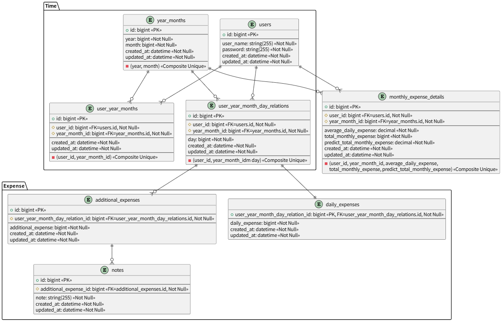

# BookKeeping

React/Vite + Rails GraphQL + MySQL

## Database



## Start

Make sure Docker Desktop has installed.

```
docker compose up --build

# running in back
docker compose up -d  
```

- frontend：http://localhost:4173
- Rails GraphiQL：http://localhost:3000/graphiql
- Rails：http://localhost:3000
- MySQL：`localhost:3306`

## Command

```powershell
# 后台启动
docker compose up -d

# 查看所有服务日志
docker compose logs -f

# 查看后端日志
docker compose logs -f backend

# 添加前端依赖
docker compose exec frontend pnpm add <package-name>

# 添加前端开发依赖
docker compose exec frontend pnpm add -D <package-name>

# 删除前端依赖
docker compose exec frontend pnpm remove <package-name>

# 停止并删除容器，保留数据库数据
docker compose down

# 进入 Rails 控制台
docker compose exec backend bundle exec rails console

# 执行数据库迁移
docker compose exec backend bundle exec rails db:migrate

# 创建用户
docker compose exec backend bundle exec rails runner 'User.create!(user_name: "example_user", password: "secure_password")'
```

If you want to restart：

```
docker compose down -v
docker compose up --build
```

## 自定义端口和数据库

Use `.env` to change setting

```
FRONTEND_PORT=4173
BACKEND_PORT=3000
MYSQL_PORT=3306
MYSQL_DATABASE=bookkeeping_backend_development
TZ=Asia/Tokyo
```

## Hint
### Rails
- Use `rails new xxxx --api`

### React Vite
#### Add to vite.config.ts
- 为了转向
  ```
  server: {
      proxy: {
        "/graphql": {
          target: "http://localhost:3000/",
          changeOrigin: true
        }
      }
    },
  ```
- 为了css(less)可以进行数学运算
  ```
  css: {
    preprocessorOptions: {
      less: {
        math: "always", // 启用数学计算
        relativeUrls: true, // 启用相对路径
        javascriptEnabled: true,
        modifyVars: {
          // 在这里可以自定义全局 Less 变量（可选）
          // '@primary-color': '#007bff',
        },
      },
    },
  },
  ```

### Apollo GraphQL
- change uri path from 3000 to 5173
`http://localhost:5173/graphql`
